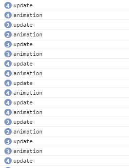
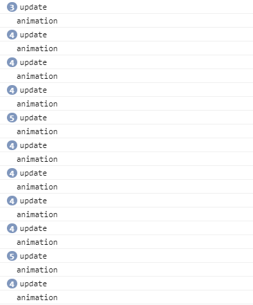

### window.requestAnimationFrame在节流中的正确应用

---
优化瀑布流的时候尝试使用window.requestAnimationFrame来优化滚动动画，在滚动过快时进行节流。但由于刚开始对于此api没有细致了解，错误使用，此处特别记下

#### 特性概述
* 翻译过来为请求动画帧，顾名思义，多使用于动画场景
* 不同于setTimeout() 的执行时间受其他事件影响而不确定，requestAnimationFrame 的刷新的频率并不是人为规定，而是根据浏览器的刷新频率而定（一般为60Hz，也可人为配置电脑）
* 保证了回调函数在屏幕每一次的刷新时间间隔中只被执行一次
* 当页面处在未激活状态，屏幕刷新任务会被暂停，有效节能
* 优雅降级，优先使用高级特性，然后根据浏览器的不同情况进行回退，直到只能使用setTimeout的情况，[polyfill](https://github.com/darius/requestAnimationFrame/blob/master/requestAnimationFrame.js)
  
---
#### 问题
* 当高频触发时，如滚动瀑布流，相应window.requestAnimationFrame也会重复执行，而不单单是回调函数重复执行，这样也可以保证节流吗？
* 原代码如下
  ````javascript
   window.onscroll = function() {
      // 监听屏幕滚动
          if (check()){
              add();
          }
         add();
      };

   function add(){
        if (done < count){  
            window.requestAnimationFrame(() =>{  
                load();
            });
        }
    }
  ````
 * 当滚动的频率过大，使一帧内执行2次window.requestAnimationFrame，若节流，load 应该仅被执行一次
 
 ---
#### 调试
* 尝试直接用瀑布流调试，但人工操作达不到一帧内触发两次onscroll
* 转为编写测试代码
  ````javascript
  let count = 0;
  let flag = false;
  let timer = setInterval(function () {
      console.log('update');
      run();
      count++;
      if (count === 100){
          clearInterval(timer);
      }
  },3);
  
  function run() {
      window.requestAnimationFrame(() => {
          flag = false;
          console.log('animation');
      });
  }
  ````
  结果如下:  
  
      
   
   可以看出，requestAnimationFrame仅仅是把回调推迟执行到每帧刷新之前，但全部都会执行，并没有节流的作用

* 改进代码
  ```javascript
   function run() {
     if (flag) return;
     flag = true;
     window.requestAnimationFrame(() => {
         flag = false;
         console.log('animation');
     });
   }
  ```
   
  结果如下： 
   
     
   
   可以看出，这种写法保证了帧与帧的之间，回调仅会被执行一次，达到节流的作用 
 
 ---  
#### 结论
* 多次调用requestAnimationFrame 并不会减少回调的执行次数，而是推迟了
* 若想要达到节流作用，需要改进，瀑布流改进如下
   ````javascript
   // 加载后续的图片
       function add(){
           if (done < count){
               if (flag) return;
   
               flag = true;
               window.requestAnimationFrame(() =>{
                   flag = false;
                   load();
               });
           }
       }
   ````
---
####参考：
1. [深入理解 requestAnimationFrame](http://web.jobbole.com/91578/)  
2. [requestAnimationFrame 方法你真的用对了吗？](https://segmentfault.com/a/1190000010229232)

---
小感概：  
平时学习都是直接记在自己电脑本地的笔记中或者纸上，写完这篇后，好想写博客啊写博客啊写博客啊……  但是搭建博客还要费时间，好想快点有个实习，这样就暂时有空倒腾这些杂七杂八的东西了呜呜呜


